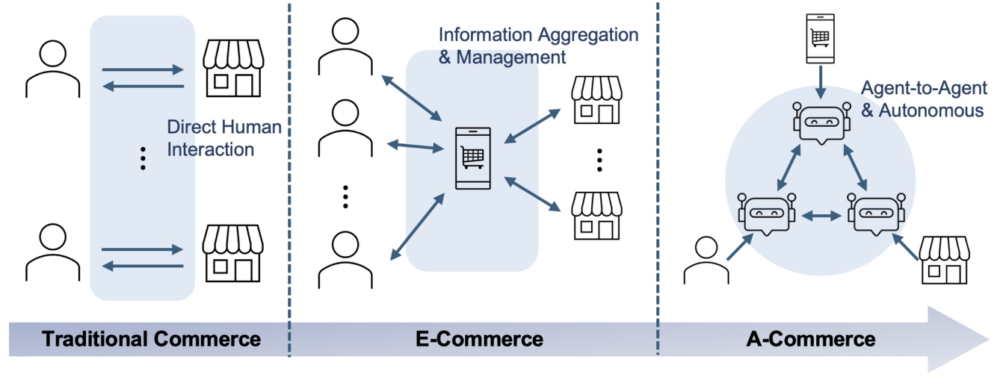
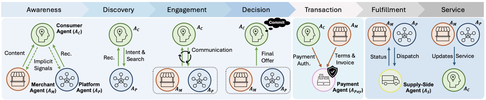

# awesome-agentic-commerce

[](http://makeapullrequest.com)
[](https://awesome.re)

A curated list of resources on **Agentic Commerce (A-Commerce)**, covering agentic e-commerce, multi-agent market and commerce systems, conversational commerce, autonomous negotiation and trading, recommendation/search agents, pricing agents, supply chain and logistics agents, and payment agents.

This repository complements the survey:

> **Agentic Commerce: A Survey of How AI Agents Are Reshaping Commerce**  
> [TechRxiv Preprint](https://d197for5662m48.cloudfront.net/documents/publicationstatus/303971/preprint_pdf/6e6fa272238a6481c4ef277f508aa97d.pdf)

```bibtex
@article{zhang2026agentic-commerce,
  title={Agentic Commerce: A Survey of How AI Agents Are Reshaping Commerce},
  author={Zhang, Yifei and Pan, Bo and Zhu, Mengdan and Pei, Jian and Zhao, Liang},
  journal={TechRxiv},
  year={2026},
  doi={10.36227/techrxiv.176972193.39211542/v1},
  url={https://www.techrxiv.org/doi/full/10.36227/techrxiv.176972193.39211542/v1}
}
```

[](assets/a-commerce.pdf)

## Industry Reports & Whitepapers

* [Boston Consulting Group 2025] Agentic Commerce Is Redefining Retail — Here's How to Respond. [link](https://www.bcg.com/publications/2025/agentic-commerce-redefining-retail-how-to-respond)
* [McKinsey & Company 2025] The Agentic Commerce Opportunity: How AI Agents Are Ushering in a New Era for Consumers and Merchants. [link](https://www.mckinsey.com/capabilities/quantumblack/our-insights/the-agentic-commerce-opportunity-how-ai-agents-are-ushering-in-a-new-era-for-consumers-and-merchants)
* [Mastercard 2025] What is agentic commerce? Your guide to AI-assisted retail. [link](https://www.mastercard.com/global/en/news-and-trends/stories/2025/agentic-commerce-explainer.html)
* [Visa 2025] What Is Agentic Commerce? [link](https://corporate.visa.com/en/sites/visa-perspectives/innovation/what-is-agentic-commerce.html)
* [Google Cloud 2025] Agentic commerce is here: How retailers can prepare for the new shopping era [link](https://cloud.google.com/transform/agentic-commerce-retailers-can-prepare-for-the-new-shopping-era-ai)
* [Shopify 2025] AI Agents: Harnessing Agentic AI for Ecommerce Businesses [link](https://www.shopify.com/blog/ai-agents)
---

## Part I: Commerce Pipeline (Survey Taxonomy)

*Organization: **Stage** → **Agent Role** (as defined in the survey).*  
*Lifecycle stages (§2): Awareness → Discovery → Engagement → Decision → Transaction → Fulfillment → Service.*

[](assets/pipeline.pdf)

### Awareness

> **Stage focus:** pre-intent exposure and demand formation (who gets seen, when, and under what constraints)

#### Merchant-Agent

* [TKDE 2024] Hierarchical Multi-Agent Meta-Reinforcement Learning for Cross-Channel Bidding. [link](https://ieeexplore.ieee.org/document/10817487/)
* [EMNLP Industry 2024] IPL: Leveraging Multimodal Large Language Models for Intelligent Product Listing. [link](https://aclanthology.org/2024.emnlp-industry.52.pdf)
* [ICLR 2025 FM-Wild Workshop] Agentic Multimodal AI for Hyper-Personalized B2B and B2C Advertising in Competitive Markets: An AI-Driven Competitive Advertising Framework. [link](https://openreview.net/forum?id=4qzqY0PFRK)
* [arXiv 2025] CAL-RAG: Retrieval-Augmented Multi-Agent Generation for Content-Aware Layout Design. [link](https://arxiv.org/pdf/2506.21934)
* [WWW Companion 2025] RTBAgent: A LLM-based Agent System for Real-Time Bidding. [link](https://doi.org/10.1145/3701716.3715259)
* [CVPR 2026] E-comIQ-ZH: A Human-Aligned Dataset and Benchmark for Fine-Grained Evaluation of E-commerce Posters with Chain-of-Thought. [link](https://arxiv.org/pdf/2602.21698)
  
#### Platform-Agent

* [KDD 2023] NEON: Living Needs Prediction System in Meituan. [link](https://arxiv.org/pdf/2307.16644)
* [ACL Findings 2025] PersonaX: A Recommendation Agent-Oriented User Modeling Framework for Long Behavior Sequence. [link](https://aclanthology.org/2025.findings-acl.300/)

#### Consumer-Agent

*Largely unexplored today; a promising future direction highlighted by the survey (§3.1).*
---

### Discovery

> **Stage focus:** intent-grounded exploration via search and recommendation (finding plausible candidates, not committing)

#### Consumer-Agent

* [NeurIPS 2022] WebShop: Towards Scalable Real-World Web Interaction with Grounded Language Agents. [link](https://arxiv.org/pdf/2207.01206)
* [ACL Findings 2025] iAgent: LLM Agent as a Shield between User and Recommender Systems. [link](https://aclanthology.org/2025.findings-acl.928/)
* [REALM 2025] PAARS: Persona Aligned Agentic Retail Shoppers. [link](https://aclanthology.org/2025.realm-1.11.pdf)
* [AAAI 2026] ShoppingBench: A Real-World Intent-Grounded Shopping Benchmark for LLM-based Agents. [link](https://ojs.aaai.org/index.php/AAAI/article/view/40640)
* [ACL Industry 2026] ProductResearch: Training E-Commerce Deep Research Agents via Multi-Agent Synthetic Trajectory Distillation. [link](https://aclanthology.org/2026.acl-industry.96/)
* [arXiv 2026] Shopping Companion: A Memory-Augmented LLM Agent for Real-World E-Commerce Tasks. [link](https://arxiv.org/pdf/2603.14864)
* [arXiv 2026] SimPersona: Learning Discrete Buyer Personas from Raw Clickstreams for Grounded E-Commerce Agents. [link](https://arxiv.org/abs/2605.14205)
* [arXiv 2026] RecoAtlas: From Semantic Plausibility to Set-Level Utility in LLM Recommendation Agents. [link](https://arxiv.org/abs/2605.18805)

#### Platform-Agent

* [WWW 2024] AgentCF: Collaborative Learning with Autonomous Language Agents for Recommender Systems. [link](https://doi.org/10.1145/3589334.3645537)
* [SIGIR 2024] Let Me Do It For You: Towards LLM Empowered Recommendation via Tool Learning. [link](https://dl.acm.org/doi/abs/10.1145/3626772.3657828)
* [SIGIR 2024] MACRec: A Multi-Agent Collaboration Framework for Recommendation. [link](https://dl.acm.org/doi/abs/10.1145/3626772.3657669)
* [SIGIR 2024] On Generative Agents in Recommendation. [link](https://dl.acm.org/doi/pdf/10.1145/3626772.3657844)
* [NAACL Findings 2024] RecMind: Large Language Model Powered Agent For Recommendation. [link](https://aclanthology.org/2024.findings-naacl.271/)
* [SIGIR 2025] Agentic Feedback Loop Modeling Improves Recommendation and User Simulation. [link](https://doi.org/10.1145/3726302.3729893)
* [NeurIPS 2025 Datasets & Benchmarks] AgentRecBench: Benchmarking LLM Agent-based Personalized Recommender Systems. [link](https://proceedings.neurips.cc/paper_files/paper/2025/file/e2d6f7249add096e26679eade1b4cc6f-Paper-Datasets_and_Benchmarks_Track.pdf)
* [arXiv 2025] ARAG: Agentic Retrieval Augmented Generation for Personalized Recommendation. [link](https://arxiv.org/pdf/2506.21931)
* [arXiv 2025] Beyond Retrieval-Ranking: A Multi-Agent Cognitive Decision Framework for E-Commerce Search. [link](https://arxiv.org/pdf/2510.20567)
* [arXiv 2025] CARTS: Collaborative Agents for Recommendation Textual Summarization. [link](https://arxiv.org/pdf/2506.17765)
* [WSDM 2025] Enhancing E-Commerce Query Rewriting: A Large Language Model Approach with Domain-Specific Pre-Training and Reinforcement Learning. [link](https://dl.acm.org/doi/epdf/10.1145/3627673.3680109)
* [arXiv 2025] Enterprise Deep Research: Steerable MultiAgent Deep Research for Enterprise Analytics. [link](https://arxiv.org/pdf/2510.17797)
* [KDD 2025] LocalGPT: Benchmarking and Advancing Large Language Models for Local Life Services in Meituan. [link](https://doi.org/10.1145/3711896.3737196)
* [KDD 2026] LocalSearchBench: Benchmarking Agentic Search in Real-World Local Life Services. [link](https://doi.org/10.1145/3770855.3817466)
* [arXiv 2025] LORE: A Large Generative Model for Search Relevance. [link](https://arxiv.org/pdf/2512.03025)
* [WWW 2025] LREF: A Novel LLM-based Relevance Framework for E-commerce Search. [link](https://dl.acm.org/doi/pdf/10.1145/3701716.3715246)
* [KDD 2026] Thought-Augmented Planning for LLM-Powered Interactive Recommender Agent. [link](https://doi.org/10.1145/3770854.3780286)
* [TMLR 2025] Rec-R1: Bridging generative large language models and user-centric recommendation systems via reinforcement learning. [link](https://openreview.net/forum?id=YBRU9MV2vE)
* [ACL Industry 2025] User Feedback Alignment for LLM-powered Exploration in Large-scale Recommendation Systems. [link](https://aclanthology.org/2025.acl-industry.70.pdf)
* [arXiv 2026] Enhancing Local Life Service Recommendation with Agentic Reasoning in Large Language Model. [link](https://arxiv.org/pdf/2604.14051)
* [arXiv 2026] QueryAgent-R1: Bridging Query Generation and Product Retrieval for E-Commerce Query Recommendation. [link](https://arxiv.org/abs/2606.05671)
* [arXiv 2026] SafeGEO: Understanding Generative Engine Optimization Risks in Recommendation Agents. [link](https://arxiv.org/abs/2606.28356)
* [arXiv 2026] $\tau$-Rec: A Verifiable Benchmark for Agentic Recommender Systems. [link](https://arxiv.org/abs/2606.10156)
* [arXiv 2026] Iterating Toward Better Search: A Two-Agent Simulation Framework for Evaluating Agentic Search Architectures in E-Commerce. [link](https://arxiv.org/abs/2606.12924)
* [arXiv 2026] ShopX: A Foundation Model for Intent-to-Item Fulfillment in Agentic Shopping. [link](https://arxiv.org/abs/2606.31693)
---

### Engagement

#### Consumer-Agent

* [arXiv 2024] ChatShop: Interactive information seeking with language agents. [link](https://arxiv.org/pdf/2404.09911)
* [PNAS 2026] Advancing AI Negotiations: A Large-Scale Autonomous Negotiation Competition. [link](https://doi.org/10.1073/pnas.2521774123)
* [NLLP 2025] The Automated but Risky Game: Modeling Agent-to-Agent Negotiations and Transactions in Consumer Markets. [link](https://aclanthology.org/2025.nllp-1.2.pdf)

#### Merchant-Agent

* [arXiv 2025] AI-Salesman: Towards Reliable Large Language Model Driven Telemarketing. [link](https://www.arxiv.org/pdf/2511.12133)
* [EMNLP 2025] ASTRA: A Negotiation Agent with Adaptive and Strategic Reasoning via Tool-integrated Action for Dynamic Offer Optimization. [link](https://aclanthology.org/2025.emnlp-main.821.pdf)
* [IWSDS 2025] Exploring Personality-Aware Interactions in Salesperson Dialogue Agents. [link](https://aclanthology.org/2025.iwsds-1.6.pdf)
* [WWW Companion 2025] FishBargain: An LLM-Empowered Bargaining Agent for Online Fleamarket Platform Sellers. [link](https://doi.org/10.1145/3701716.3715176)
* [arXiv 2025] SalesRLAgent: A Reinforcement Learning Approach for Real-Time Sales Conversion Prediction and Optimization. [link](https://arxiv.org/pdf/2503.23303)
* [EMNLP Findings 2025] Towards Personalized Conversational Sales Agents: Contextual User Profiling for Strategic Action. [link](https://aclanthology.org/2025.findings-emnlp.275.pdf)
* [CVPR 2026 HiGen Workshop] VerbalValue: A Socially Intelligent Virtual Host for Sales-Driven Live Commerce. [link](https://higen-2025.github.io/index.html)

#### Platform-Agent

* [KDD 2025] DiMA: An LLM-Powered Ride-Hailing Assistant at DiDi. [link](https://doi.org/10.1145/3711896.3737208)
* [ACM Transactions on Information Systems 2025] Recommender AI Agent: Integrating Large Language Models for Interactive Recommendations. [link](https://arxiv.org/pdf/2308.16505)
* [ACL Findings 2025] Expectation Confirmation Preference Optimization for Multi-Turn Conversational Recommendation Agent. [link](https://aclanthology.org/2025.findings-acl.307/)
* [arXiv 2025] Cite Before You Speak: Enhancing Context-Response Grounding in E-commerce Conversational LLM-Agents. [link](https://arxiv.org/abs/2503.04830)

---

### Decision

#### Consumer-Agent

* [ACL 2025] Personal Travel Solver: A Preference-Driven LLM-Solver System for Travel Planning. [link](https://aclanthology.org/2025.acl-long.1339.pdf)
* [Amazon 2024] Help Me Decide: AI-powered product comparison on Amazon. [link](https://www.aboutamazon.com/news/retail/amazon-things-to-buy-help-me-decide-gen-ai)
* [arXiv 2026] EComAgentBench: Benchmarking Shopping Agents on Long-Horizon Tasks with Distributed Hidden Intent. [link](https://arxiv.org/abs/2606.17698)

---


### Transaction

#### Payment-Agent

* [IEEE BigData 2025] CASE: An Agentic AI Framework for Enhancing Scam Intelligence in Digital Payments. [link](https://doi.org/10.1109/BigData66926.2025.11402424)
* [Google Cloud] Powering AI commerce with the new Agent Payments Protocol (AP2). [link](https://cloud.google.com/blog/products/ai-machine-learning/announcing-agents-to-payments-ap2-protocol)
* [GitHub] Zen7 Payment Agent: A Dedicated Payment Network. [link](https://github.com/Zen7-Labs/Zen7-Payment-Agent)
* [arXiv 2025] Secure Autonomous Agent Payments: Verifying Authenticity and Intent in a Trustless Environment. [link](https://arxiv.org/pdf/2511.15712)
* [Skyfire] KYA & Payments for Agents. [link](https://skyfire.xyz/product/)
* [arXiv 2026] Five Attacks on x402 Agentic Payment Protocol. [link](https://arxiv.org/abs/2605.11781)
* [arXiv 2026] RAILS: Verification-Native Clearing For Agentic Commerce. [link](https://arxiv.org/abs/2606.08790)

---

### Fulfillment

#### Supply-Side Agent

* [IROS 2023] L3MVN: Leveraging Large Language Models for Visual Target Navigation. [link](https://doi.org/10.1109/IROS55552.2023.10342512)
* [CoRL 2023] RT-2: Vision-Language-Action Models Transfer Web Knowledge to Robotic Control. [link](https://arxiv.org/pdf/2307.15818)
* [RSS 2024] RoboCasa: Large-Scale Simulation of Everyday Tasks for Generalist Robots. [link](https://rpl.cs.utexas.edu/publications/2024/07/15/nasiriany-rss24-robocasa/)
* [arXiv 2024] Agentic LLMs in the Supply Chain: Towards Autonomous Multi-Agent Consensus-Seeking. [link](https://arxiv.org/abs/2411.10184)
* [ICBDT 2025] Agentic AI Framework for Smart Inventory Replenishment. [link](https://www.arxiv.org/pdf/2511.23366)
* [arXiv 2025] AIM-Bench: Evaluating Decision-making Biases of Agentic LLM as Inventory Manager. [link](https://arxiv.org/abs/2508.11416)
* [arXiv 2025] Leveraging LLM-Based Agents for Intelligent Supply Chain Planning. [link](https://arxiv.org/pdf/2509.03811)
* [CoRL 2025] Mobility VLA: Multimodal Instruction Navigation with Long-Context VLMs and Topological Graphs. [link](https://proceedings.mlr.press/v270/xu25b.html)
* [ICRA 2025] Physics-Aware Robotic Palletization with Online Masking Inference. [link](https://doi.org/10.1109/ICRA55743.2025.11128204)
* [Sustainability 2025] Research on Composite Robot Scheduling and Task Allocation for Warehouse Logistics Systems. [link](https://www.mdpi.com/2071-1050/17/11/5051)
* [ICCV 2025] RoboFactory: Exploring Embodied Agent Collaboration with Compositional Constraints. [link](https://openaccess.thecvf.com/content/ICCV2025/html/Qin_RoboFactory_Exploring_Embodied_Agent_Collaboration_with_Compositional_Constraints_ICCV_2025_paper.html)
* [IEEE CASE 2025] Safe Human Robot Navigation in Warehouse Scenario. [link](https://doi.org/10.1109/CASE58245.2025.11164151)
* [ICRA Workshop 2025] Task Planning for Mobile Manipulation in Retail Stores using Foundation Models with Iterative Re-planning. [link](https://dyalab.mines.edu/2025/icra-workshop/18.pdf)

---

### Service

#### Consumer-Agent

*No canonical benchmark/paper list yet in the survey; contributions welcome.*

#### Platform-Agent

* [arXiv 2025] Higher Satisfaction, Lower Cost: A Technical Report on How LLMs Revolutionize Meituan's Intelligent Interaction Systems. [link](https://arxiv.org/pdf/2510.13291)
* [arXiv 2025] MindFlow+: A Self-Evolving Agent for E-Commerce Customer Service. [link](https://arxiv.org/pdf/2507.18884)

---

## Part II: Applications & Protocols

### Retail Shopping & Personal Assistants

* [OpenAI] Shopping Research in ChatGPT. [link](https://openai.com)
* [OpenAI] Buy it in ChatGPT. [link](https://developers.openai.com)
* [Perplexity] Shop like a Pro. [link](https://perplexity.ai)
* [Amazon] Rufus: AI Shopping Assistant. [link](https://aws.amazon.com/solutions/amazon/one-amazon-lane/shopping-tools/)
* [Amazon 2025] Buy for Me. [link](https://www.aboutamazon.com/news/retail/amazon-shopping-app-buy-for-me-brands)
* [NeurIPS 2022] WebShop: Towards Scalable Real-World Web Interaction with Grounded Language Agents. [link](https://arxiv.org/pdf/2207.01206)
* [arXiv 2023] Intelligent Virtual Assistants with LLM-based Process Automation. [link](https://arxiv.org/pdf/2312.06677)
* [arXiv 2024] TravelAgent: An AI Assistant for Personalized Travel Planning. [link](https://arxiv.org/pdf/2409.08069)
* [CVPR 2024] Wear-Any-Way: Manipulable Virtual Try-on via Sparse Correspondence Alignment. [link](https://arxiv.org/pdf/2403.12965)
* [ICML 2025] Position: Build Agent Advocates, Not Platform Agents. [link](https://proceedings.mlr.press/v267/kapoor25a.html)
* [KDD 2026] DeepTravel: An End-to-End Agentic Reinforcement Learning Framework for Autonomous Travel Planning Agents. [link](https://arxiv.org/pdf/2509.21842)
* [arXiv 2025] FashionPose: Text to Pose to Relight Image Generation for Personalized Fashion Visualization. [link](https://arxiv.org/pdf/2507.13311)
* [arXiv 2025] Flippi: End To End GenAI Assistant for E-Commerce. [link](https://arxiv.org/pdf/2507.05788)
* [ACL Findings 2025] iAgent: LLM Agent as a Shield between User and Recommender Systems. [link](https://aclanthology.org/2025.findings-acl.928/)
* [REALM 2025] PAARS: Persona Aligned Agentic Retail Shoppers. [link](https://aclanthology.org/2025.realm-1.11.pdf)
* [ACL 2025] Personal Travel Solver: A Preference-Driven LLM-Solver System for Travel Planning. [link](https://aclanthology.org/2025.acl-long.1339.pdf)
* [EMNLP 2025] RETAIL: Towards Real-world Travel Planning for Large Language Models. [link](https://aclanthology.org/2025.emnlp-main.752.pdf)
* [arXiv 2025] What Is Your AI Agent Buying? Evaluation, Implications, and Emerging Questions for Agentic E-Commerce. [link](https://arxiv.org/pdf/2508.02630)
* [ACL Industry 2026] ProductResearch: Training E-Commerce Deep Research Agents via Multi-Agent Synthetic Trajectory Distillation. [link](https://aclanthology.org/2026.acl-industry.96/)
* [arXiv 2026] Shopping Companion: A Memory-Augmented LLM Agent for Real-World E-Commerce Tasks. [link](https://arxiv.org/pdf/2603.14864)
* [arXiv 2026] SimPersona: Learning Discrete Buyer Personas from Raw Clickstreams for Grounded E-Commerce Agents. [link](https://arxiv.org/abs/2605.14205)
* [arXiv 2026] EComAgentBench: Benchmarking Shopping Agents on Long-Horizon Tasks with Distributed Hidden Intent. [link](https://arxiv.org/abs/2606.17698)
* [arXiv 2026] ShopX: A Foundation Model for Intent-to-Item Fulfillment in Agentic Shopping. [link](https://arxiv.org/abs/2606.31693)


### Marketplaces (C2C / P2P)

* [arXiv 2025] FaMA: LLM-Empowered Agentic Assistant for Consumer-to-Consumer Marketplace. [link](https://arxiv.org/pdf/2509.03890v1)
* [WWW Companion 2025] FishBargain: An LLM-Empowered Bargaining Agent for Online Fleamarket Platform Sellers. [link](https://doi.org/10.1145/3701716.3715176)
* [NLLP 2025] The Automated but Risky Game: Modeling Agent-to-Agent Negotiations and Transactions in Consumer Markets. [link](https://aclanthology.org/2025.nllp-1.2.pdf)

### Advertising, Bidding & Merchant Growth

* [TKDE 2024] Hierarchical Multi-Agent Meta-Reinforcement Learning for Cross-Channel Bidding. [link](https://ieeexplore.ieee.org/document/10817487/)
* [EMNLP Industry 2024] IPL: Leveraging Multimodal Large Language Models for Intelligent Product Listing. [link](https://aclanthology.org/2024.emnlp-industry.52.pdf)
* [ICLR 2025 FM-Wild Workshop] Agentic Multimodal AI for Hyper-Personalized B2B and B2C Advertising in Competitive Markets: An AI-Driven Competitive Advertising Framework. [link](https://openreview.net/forum?id=4qzqY0PFRK)
* [arXiv 2025] CAL-RAG: Retrieval-Augmented Multi-Agent Generation for Content-Aware Layout Design. [link](https://arxiv.org/pdf/2506.21934)
* [SIGIR 2025] Insight Agents: An LLM-Based Multi-Agent System for Data Insights. [link](https://arxiv.org/pdf/2601.20048)
* [WWW Companion 2025] RTBAgent: A LLM-based Agent System for Real-Time Bidding. [link](https://doi.org/10.1145/3701716.3715259)
* [CVPR 2026] E-comIQ-ZH: A Human-Aligned Dataset and Benchmark for Fine-Grained Evaluation of E-commerce Posters with Chain-of-Thought. [link](https://arxiv.org/pdf/2602.21698)

### Sales & Customer Service

* [Amazon] Seller Assistant. [link](https://aws.amazon.com/solutions/amazon/one-amazon-lane/home-office/)
* [arXiv 2025] AI-Salesman: Towards Reliable Large Language Model Driven Telemarketing. [link](https://www.arxiv.org/pdf/2511.12133)
* [IWSDS 2025] Exploring Personality-Aware Interactions in Salesperson Dialogue Agents. [link](https://aclanthology.org/2025.iwsds-1.6.pdf)
* [arXiv 2025] MindFlow+: A Self-Evolving Agent for E-Commerce Customer Service. [link](https://arxiv.org/pdf/2507.18884)
* [arXiv 2025] SalesRLAgent: A Reinforcement Learning Approach for Real-Time Sales Conversion Prediction and Optimization. [link](https://arxiv.org/pdf/2503.23303)
* [EMNLP Findings 2025] Towards Personalized Conversational Sales Agents: Contextual User Profiling for Strategic Action. [link](https://aclanthology.org/2025.findings-emnlp.275.pdf)
* [arXiv 2025] Cite Before You Speak: Enhancing Context-Response Grounding in E-commerce Conversational LLM-Agents. [link](https://arxiv.org/abs/2503.04830)
* [arXiv 2026] SalesSim: Benchmarking and Aligning Multimodal Language Models as Retail User Simulators. [link](https://arxiv.org/abs/2605.08334)
* [CVPR 2026 HiGen Workshop] VerbalValue: A Socially Intelligent Virtual Host for Sales-Driven Live Commerce. [link](https://higen-2025.github.io/index.html)

### Recommendation & Search Systems

* [KDD 2023] NEON: Living Needs Prediction System in Meituan. [link](https://arxiv.org/pdf/2307.16644)
* [WWW 2024] AgentCF: Collaborative Learning with Autonomous Language Agents for Recommender Systems. [link](https://doi.org/10.1145/3589334.3645537)
* [SIGIR 2024] Let Me Do It For You: Towards LLM Empowered Recommendation via Tool Learning. [link](https://dl.acm.org/doi/abs/10.1145/3626772.3657828)
* [SIGIR 2024] MACRec: A Multi-Agent Collaboration Framework for Recommendation. [link](https://dl.acm.org/doi/abs/10.1145/3626772.3657669)
* [SIGIR 2024] On Generative Agents in Recommendation. [link](https://dl.acm.org/doi/pdf/10.1145/3626772.3657844)
* [NAACL Findings 2024] RecMind: Large Language Model Powered Agent For Recommendation. [link](https://aclanthology.org/2024.findings-naacl.271/)
* [SIGIR 2025] Agentic Feedback Loop Modeling Improves Recommendation and User Simulation. [link](https://doi.org/10.1145/3726302.3729893)
* [NeurIPS 2025 Datasets & Benchmarks] AgentRecBench: Benchmarking LLM Agent-based Personalized Recommender Systems. [link](https://proceedings.neurips.cc/paper_files/paper/2025/file/e2d6f7249add096e26679eade1b4cc6f-Paper-Datasets_and_Benchmarks_Track.pdf)
* [arXiv 2025] ARAG: Agentic Retrieval Augmented Generation for Personalized Recommendation. [link](https://arxiv.org/pdf/2506.21931)
* [arXiv 2025] Beyond Retrieval-Ranking: A Multi-Agent Cognitive Decision Framework for E-Commerce Search. [link](https://arxiv.org/pdf/2510.20567)
* [arXiv 2025] CARTS: Collaborative Agents for Recommendation Textual Summarization. [link](https://arxiv.org/pdf/2506.17765)
* [WSDM 2025] Enhancing E-Commerce Query Rewriting: A Large Language Model Approach with Domain-Specific Pre-Training and Reinforcement Learning. [link](https://dl.acm.org/doi/epdf/10.1145/3627673.3680109)
* [arXiv 2025] Enterprise Deep Research: Steerable MultiAgent Deep Research for Enterprise Analytics. [link](https://arxiv.org/pdf/2510.17797)
* [arXiv 2025] Higher Satisfaction, Lower Cost: A Technical Report on How LLMs Revolutionize Meituan's Intelligent Interaction Systems. [link](https://arxiv.org/pdf/2510.13291)
* [KDD 2025] LocalGPT: Benchmarking and Advancing Large Language Models for Local Life Services in Meituan. [link](https://doi.org/10.1145/3711896.3737196)
* [KDD 2026] LocalSearchBench: Benchmarking Agentic Search in Real-World Local Life Services. [link](https://doi.org/10.1145/3770855.3817466)
* [arXiv 2025] LORE: A Large Generative Model for Search Relevance. [link](https://arxiv.org/pdf/2512.03025)
* [WWW 2025] LREF: A Novel LLM-based Relevance Framework for E-commerce Search. [link](https://dl.acm.org/doi/pdf/10.1145/3701716.3715246)
* [ACM Transactions on Information Systems 2025] Recommender AI Agent: Integrating Large Language Models for Interactive Recommendations. [link](https://arxiv.org/pdf/2308.16505)
* [ACL Findings 2025] Expectation Confirmation Preference Optimization for Multi-Turn Conversational Recommendation Agent. [link](https://aclanthology.org/2025.findings-acl.307/)
* [KDD 2026] Thought-Augmented Planning for LLM-Powered Interactive Recommender Agent. [link](https://doi.org/10.1145/3770854.3780286)
* [TMLR 2025] Rec-R1: Bridging generative large language models and user-centric recommendation systems via reinforcement learning. [link](https://openreview.net/forum?id=YBRU9MV2vE)
* [arXiv 2025] The Future is Agentic: Definitions, Perspectives, and Open Challenges of Multi-Agent Recommender Systems. [link](https://arxiv.org/abs/2507.02097)
* [ACL Industry 2025] User Feedback Alignment for LLM-powered Exploration in Large-scale Recommendation Systems. [link](https://aclanthology.org/2025.acl-industry.70.pdf)
* [arXiv 2026] Enhancing Local Life Service Recommendation with Agentic Reasoning in Large Language Model. [link](https://arxiv.org/pdf/2604.14051)
* [arXiv 2026] RecoAtlas: From Semantic Plausibility to Set-Level Utility in LLM Recommendation Agents. [link](https://arxiv.org/abs/2605.18805)
* [arXiv 2026] QueryAgent-R1: Bridging Query Generation and Product Retrieval for E-Commerce Query Recommendation. [link](https://arxiv.org/abs/2606.05671)
* [arXiv 2026] SafeGEO: Understanding Generative Engine Optimization Risks in Recommendation Agents. [link](https://arxiv.org/abs/2606.28356)
* [arXiv 2026] $\tau$-Rec: A Verifiable Benchmark for Agentic Recommender Systems. [link](https://arxiv.org/abs/2606.10156)
* [arXiv 2026] Iterating Toward Better Search: A Two-Agent Simulation Framework for Evaluating Agentic Search Architectures in E-Commerce. [link](https://arxiv.org/abs/2606.12924)
* [arXiv 2026] ShopX: A Foundation Model for Intent-to-Item Fulfillment in Agentic Shopping. [link](https://arxiv.org/abs/2606.31693)

### Platform Services & Enterprise Solutions

* [OpenAI] Operator. [link](https://openai.com/index/introducing-operator/)
* [Adobe] Adobe Experience Platform Agent Orchestrator. [link](https://business.adobe.com)
* [Salesforce] Artificial Intelligence (AI) at Salesforce. [link](https://salesforce.com)

### Mobility & On-demand Services

* [Transportation Research Part C 2025] Agentic Large Language Models for day-to-day route choices (LLMTraveler). [link](https://www.sciencedirect.com/science/article/pii/S0968090X25003110)
* [KDD 2025] DiMA: An LLM-Powered Ride-Hailing Assistant at DiDi. [link](https://doi.org/10.1145/3711896.3737208)
* [IEEE TASE 2026] RideAgent: An LLM-Enhanced Optimization Framework for Automated Taxi Fleet Operations. [link](https://doi.org/10.1109/TASE.2026.3685621)

### Unmanned Stores & Autonomous Retail

* [Wikipedia] Amazon Go. [link](https://en.wikipedia.org/wiki/Amazon_Go)
* [Nature Scientific Reports 2024] Smart customer service in unmanned retail store enhanced by large language model. [link](https://www.nature.com/articles/s41598-024-71089-9)
* [arXiv 2025] A Survey of Challenges and Sensing Technologies in Autonomous Retail Systems. [link](https://arxiv.org/pdf/2503.07997)

### Intelligent Cockpit & In-Vehicle Commerce

* [SoundHound 2025] CES 2025: SoundHound AI Debuts Its First Ever In-Vehicle Voice Assistant With On-The-Go Food Ordering. [link](https://www.soundhound.com/newsroom/press-releases/ces-2025-soundhound-ai-debuts-its-first-ever-in-vehicle-voice-assistant-with-on-the-go-food-ordering)
* [Alibaba Cloud 2025] Alibaba Unveils Intelligent Cockpits, Enterprise Partnerships and AI Glasses at WAIC 2025. [link](https://www.alibabacloud.com/blog/alibaba-unveils-intelligent-cockpits-enterprise-partnerships-and-ai-glasses-at-waic-2025_602409)

### Supply Chain, Warehousing & Embodied Commerce

* [IROS 2023] L3MVN: Leveraging Large Language Models for Visual Target Navigation. [link](https://doi.org/10.1109/IROS55552.2023.10342512)
* [CoRL 2023] RT-2: Vision-Language-Action Models Transfer Web Knowledge to Robotic Control. [link](https://arxiv.org/pdf/2307.15818)
* [IROS 2025] AssistantX: An LLM-Powered Proactive Assistant in Collaborative Human-Populated Environments. [link](https://doi.org/10.1109/IROS60139.2025.11246901)
* [RSS 2024] RoboCasa: Large-Scale Simulation of Everyday Tasks for Generalist Robots. [link](https://rpl.cs.utexas.edu/publications/2024/07/15/nasiriany-rss24-robocasa/)
* [arXiv 2024] Agentic LLMs in the Supply Chain: Towards Autonomous Multi-Agent Consensus-Seeking. [link](https://arxiv.org/abs/2411.10184)
* [ICBDT 2025] Agentic AI Framework for Smart Inventory Replenishment. [link](https://www.arxiv.org/pdf/2511.23366)
* [arXiv 2025] AIM-Bench: Evaluating Decision-making Biases of Agentic LLM as Inventory Manager. [link](https://arxiv.org/abs/2508.11416)
* [NeurIPS 2025 Datasets & Benchmarks] IndustryEQA: Pushing the Frontiers of Embodied Question Answering in Industrial Scenarios. [link](https://papers.neurips.cc/paper_files/paper/2025/hash/941de7aa5976f372117725abd87c639a-Abstract-Datasets_and_Benchmarks_Track.html)
* [arXiv 2025] Leveraging LLM-Based Agents for Intelligent Supply Chain Planning. [link](https://arxiv.org/pdf/2509.03811)
* [CoRL 2025] Mobility VLA: Multimodal Instruction Navigation with Long-Context VLMs and Topological Graphs. [link](https://proceedings.mlr.press/v270/xu25b.html)
* [arXiv 2025] Multi-Agent Reinforcement Learning for Dynamic Pricing in Supply Chains: Benchmarking Strategic Agent Behaviours under Realistically Simulated Market Conditions. [link](https://arxiv.org/pdf/2507.02698)
* [ICRA 2025] Physics-Aware Robotic Palletization with Online Masking Inference. [link](https://doi.org/10.1109/ICRA55743.2025.11128204)
* [Sustainability 2025] Research on Composite Robot Scheduling and Task Allocation for Warehouse Logistics Systems. [link](https://www.mdpi.com/2071-1050/17/11/5051)
* [ICCV 2025] RoboFactory: Exploring Embodied Agent Collaboration with Compositional Constraints. [link](https://openaccess.thecvf.com/content/ICCV2025/html/Qin_RoboFactory_Exploring_Embodied_Agent_Collaboration_with_Compositional_Constraints_ICCV_2025_paper.html)
* [IEEE CASE 2025] Safe Human Robot Navigation in Warehouse Scenario. [link](https://doi.org/10.1109/CASE58245.2025.11164151)
* [ICRA Workshop 2025] Task Planning for Mobile Manipulation in Retail Stores using Foundation Models with Iterative Re-planning. [link](https://dyalab.mines.edu/2025/icra-workshop/18.pdf)
* [Amazon] Amazon has more than 1 million robots that sort, lift, and carry packages—see them in action. [link](https://www.aboutamazon.com/news/operations/amazon-robotics-robots-fulfillment-center)

### Negotiation & Pricing

* [ICML 2024] CompeteAI: Understanding the Competition Dynamics of Large Language Model-based Agents. [link](https://proceedings.mlr.press/v235/zhao24q.html)
* [ICML 2024] How Well Can LLMs Negotiate? NegotiationArena Platform and Analysis. [link](https://proceedings.mlr.press/v235/bianchi24a.html)
* [PNAS 2026] Advancing AI Negotiations: A Large-Scale Autonomous Negotiation Competition. [link](https://doi.org/10.1073/pnas.2521774123)
* [arXiv 2026] TERMS-Bench: Diagnosing LLM Negotiation Agents Beyond Deal Rate. [link](https://arxiv.org/abs/2605.13909)

### Protocols & Standards

* [Model Context Protocol] Model Context Protocol (MCP). [link](https://modelcontextprotocol.io)
* [Agent2Agent Protocol] Agent2Agent (A2A) Protocol. [link](https://a2a-protocol.org)
* [OpenAI] Agentic Commerce Protocol (ACP). [link](https://github.com/openai/agentic-commerce-protocol)
* [W3C 2025] Verifiable Credentials 2.0 family of specifications. [link](https://www.w3.org/news/2025/the-verifiable-credentials-2-0-family-of-specifications-is-now-a-w3c-recommendation/)
* [arXiv 2025] Agent TCP/IP: An Agent-to-Agent Transaction System. [link](https://arxiv.org/pdf/2501.06243)
* [arXiv 2025] Building A Secure Agentic AI Application Leveraging Google's A2A Protocol. [link](https://arxiv.org/pdf/2504.16902)

### Payment & Transaction Protocols

* [IEEE BigData 2025] CASE: An Agentic AI Framework for Enhancing Scam Intelligence in Digital Payments. [link](https://doi.org/10.1109/BigData66926.2025.11402424)
* [Google Cloud] Powering AI commerce with the new Agent Payments Protocol (AP2). [link](https://cloud.google.com/blog/products/ai-machine-learning/announcing-agents-to-payments-ap2-protocol)
* [Skyfire] KYA & Payments for Agents. [link](https://skyfire.xyz/product/)
* [GitHub] MachinePal – x402 AI Payment Agent for Any Website or API. [link](https://github.com/skalenetwork/machinepal)
* [GitHub] Zen7 Payment Agent: A Dedicated Payment Network. [link](https://github.com/Zen7-Labs/Zen7-Payment-Agent)
* [arXiv 2025] Secure Autonomous Agent Payments: Verifying Authenticity and Intent in a Trustless Environment. [link](https://arxiv.org/pdf/2511.15712)
* [arXiv 2026] Five Attacks on x402 Agentic Payment Protocol. [link](https://arxiv.org/abs/2605.11781)
* [arXiv 2026] RAILS: Verification-Native Clearing For Agentic Commerce. [link](https://arxiv.org/abs/2606.08790)
* [arXiv 2026] How Agentic Is Agentic Commerce? A Population-Scale Measurement of x402 Adoption and Authenticity. [link](https://arxiv.org/abs/2607.12575)

---

## Part III: Benchmarks

* [NeurIPS 2022] WebShop: Towards Scalable Real-World Web Interaction with Grounded Language Agents. [link](https://arxiv.org/pdf/2207.01206)
* [ICML 2024] How Well Can LLMs Negotiate? NegotiationArena Platform and Analysis. [link](https://proceedings.mlr.press/v235/bianchi24a.html)
* [NeurIPS 2025 Datasets & Benchmarks] AgentRecBench: Benchmarking LLM Agent-based Personalized Recommender Systems. [link](https://proceedings.neurips.cc/paper_files/paper/2025/file/e2d6f7249add096e26679eade1b4cc6f-Paper-Datasets_and_Benchmarks_Track.pdf)
* [arXiv 2025] AIM-Bench: Evaluating Decision-making Biases of Agentic LLM as Inventory Manager. [link](https://arxiv.org/abs/2508.11416)
* [arXiv 2025] $\tau^2$-Bench: Evaluating Conversational Agents in a Dual-Control Environment. [link](https://arxiv.org/pdf/2506.07982)
* [arXiv 2025] DeepShop: A Benchmark for Deep Research Shopping Agents. [link](https://arxiv.org/pdf/2506.02839)
* [arXiv 2025] EcomBench: Towards Holistic Evaluation of Foundation Agents in E-commerce. [link](https://arxiv.org/pdf/2512.08868)
* [arXiv 2025] LLM Agent Meets Agentic AI: Can LLM Agents Simulate Customers to Evaluate Agentic-AI-based Shopping Assistants? [link](https://arxiv.org/pdf/2509.21501)
* [KDD 2025] LocalGPT: Benchmarking and Advancing Large Language Models for Local Life Services in Meituan. [link](https://doi.org/10.1145/3711896.3737196)
* [KDD 2026] LocalSearchBench: Benchmarking Agentic Search in Real-World Local Life Services. [link](https://doi.org/10.1145/3770855.3817466)
* [arXiv 2025] Magentic Marketplace: An Open-Source Environment for Studying Agentic Markets. [link](https://arxiv.org/pdf/2510.25779)
* [arXiv 2025] Multi-Agent Reinforcement Learning for Dynamic Pricing in Supply Chains: Benchmarking Strategic Agent Behaviours under Realistically Simulated Market Conditions. [link](https://arxiv.org/pdf/2507.02698)
* [AAAI 2026] ShoppingBench: A Real-World Intent-Grounded Shopping Benchmark for LLM-based Agents. [link](https://ojs.aaai.org/index.php/AAAI/article/view/40640)
* [ACL Industry 2025] SimUSER: Simulating User Behavior with Large Language Models for Recommender System Evaluation. [link](https://aclanthology.org/2025.acl-industry.5.pdf)
* [arXiv 2025] What Is Your AI Agent Buying? Evaluation, Implications, and Emerging Questions for Agentic E-Commerce. [link](https://arxiv.org/pdf/2508.02630)
* [ACL 2026] DeepPlanning: Benchmarking Long-Horizon Agentic Planning with Verifiable Constraints. [link](https://aclanthology.org/2026.acl-long.335/)
* [CVPR 2026] E-comIQ-ZH: A Human-Aligned Dataset and Benchmark for Fine-Grained Evaluation of E-commerce Posters with Chain-of-Thought. [link](https://arxiv.org/pdf/2602.21698)
* [arXiv 2026] Shopping Companion: A Memory-Augmented LLM Agent for Real-World E-Commerce Tasks. [link](https://arxiv.org/pdf/2603.14864)
* [ICLR 2026] VitaBench: Benchmarking LLM Agents with Versatile Interactive Tasks in Real-world Applications. [link](https://arxiv.org/pdf/2509.26490)
* [arXiv 2026] SalesSim: Benchmarking and Aligning Multimodal Language Models as Retail User Simulators. [link](https://arxiv.org/abs/2605.08334)
* [arXiv 2026] RecoAtlas: From Semantic Plausibility to Set-Level Utility in LLM Recommendation Agents. [link](https://arxiv.org/abs/2605.18805)
* [arXiv 2026] TERMS-Bench: Diagnosing LLM Negotiation Agents Beyond Deal Rate. [link](https://arxiv.org/abs/2605.13909)
* [arXiv 2026] $\tau$-Rec: A Verifiable Benchmark for Agentic Recommender Systems. [link](https://arxiv.org/abs/2606.10156)
* [arXiv 2026] EComAgentBench: Benchmarking Shopping Agents on Long-Horizon Tasks with Distributed Hidden Intent. [link](https://arxiv.org/abs/2606.17698)
  
---

## Contributing

Contributions are welcome! Please submit a Pull Request following the format:

- `[Venue Year] Paper Title. [link](url)`

## License

This work is licensed under a [Creative Commons Attribution 4.0 International License](http://creativecommons.org/licenses/by/4.0/).
